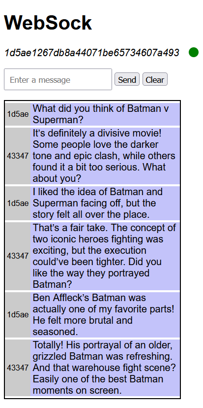
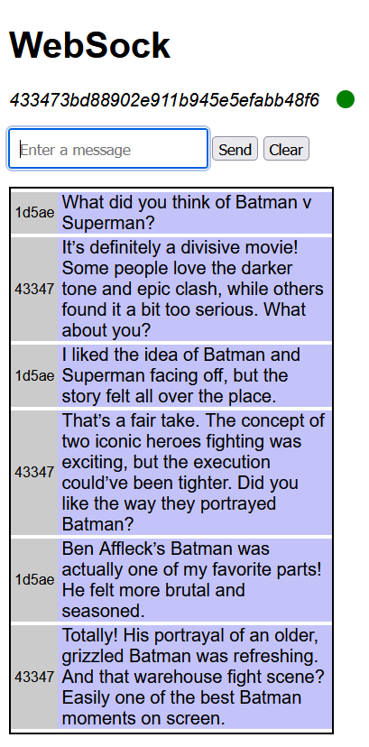

# WebSockets Demonstration

> [!WARNING]
> Though, I'm iteratively making it better but this is for only demonstration purposes **ONLY** and should not be used in production.

This is a simple implementation of WebSockets using Node.js on backend and WebSockets API on frontend for demonstration purposes ONLY. It can bev used in other projects after some tweaks and modifications.

## Requirements

- Node.Js
  - express
  - nodemon
  - ws

## Quick Start

### Backend

PORT: `5000`

```bash
$ cd ./Server
$ npm i
$ npm run dev
```

### Frontend

PORT: `3000`

```bash
$ cd ./Client
$ npm i
$ npm run dev
```

The Frontend should be running on [http://localhost:3000](http://localhost:3000).

The Backend should be running on [http://localhost:5000](http://localhost:5000). (Not to be accessed via browser)

## Gallery




[ucx15 @ GitHub](https://github.com/ucx15)
